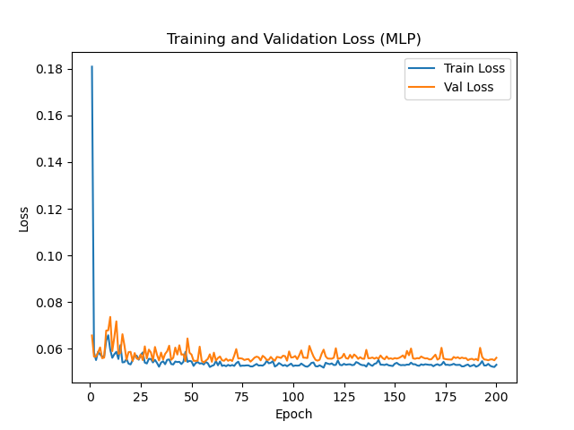
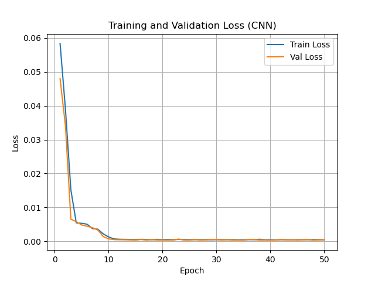
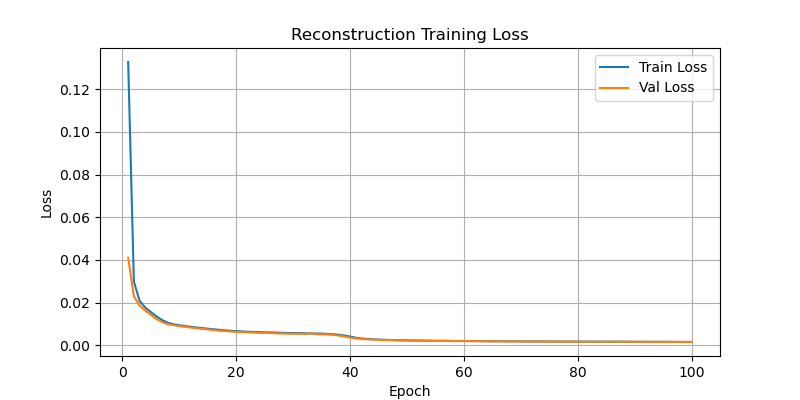
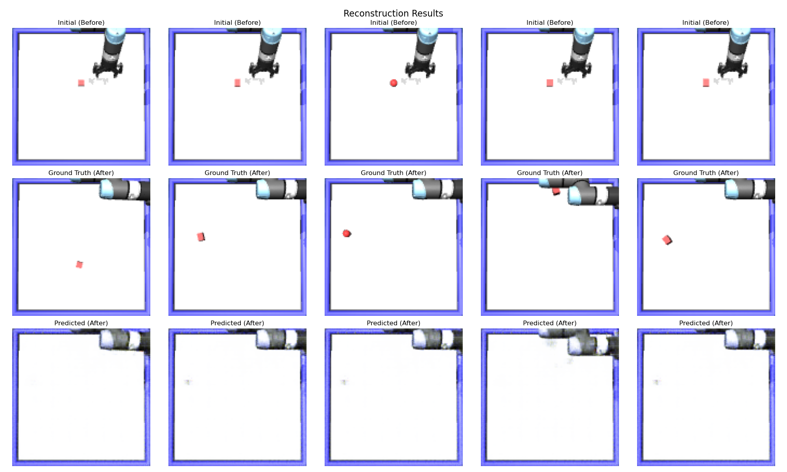

# CMPE591 Homework 1 – Robotics with Deep Learning

## 1. MLP for Object Position Estimation

- **Training Loss Plot:**  
  

- **Test Loss:**  
  Test loss value: **0.056859**

## 2. CNN for Object Position Estimation

- **Training Loss Plot:**  
  

- **Test Loss:**  
  Test loss value: **0.000445**

## 3. Image Reconstruction

- **Reconstruction Results:**
- **Training Loss Plot:**  
  
  

- **Test Loss:**  
  Test loss value: **0.000947**

P.S. For task 3, despite the network being designed to incorporate both the final target position and action for conditioning, the reconstructed images are displayed in very shallow outlining. I believe that this is a problem of computational power, such that the model is simply not trained for a sufficient number of epochs to learn the complex transformation required to reposition the object. If I was able to train the model for 500+ epochs, then the model would be able to correctly place the object at its final position I believe (Such correct position predictions can already be seen, but slightly). Other possible problems may include architectural problems (maybe the architecture I've used does not have the capacity), optimization problems, or something unknown to me.
